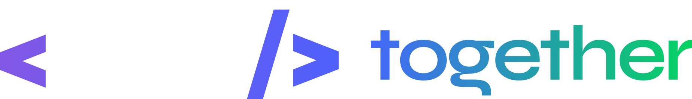

<div>
<p align="center">
   
</p>
</div>
<p align="center">	
   <a href="https://www.linkedin.com/in/luiz-lima-cezario/">
      
   </a>

  <a aria-label="Completed" href="https://nextlevelweek.com/episodios/node/aula-1/edicao/6">
    </img>
  </a>
  <a href="https://github.com/luizlcezario/NLW-Together/commits/master">
    
  </a> 
  
  <a href="https://github.com/luizlcezario/NLW-Together/stargazers">
    
  </a>
</p>

> :rocket: Projeto feito para conectar professores e estudantes, feito na Next Level Week #6 @Rocketseat


<div align="center">
  <sub>The NLW #6 project. Built with ❤︎ by
        <a href="https://github.com/luizlcezario">Luiz Cezario</a> 
    </a>
  </sub>
</div>

# :pushpin: Tabela de Conteúdo

* [Tecnologias](#computer-tecnologias)
* [Funcionalidades](#rocket-funcionalidades)
* [Como rodar](#construction_worker-como-rodar)
* [Encontrou um bug? Ou está faltando uma feature?](#bug-problemas)
* [Contribuindo](#tada-contribuindo)
* [Licença](#closed_book-Licença)

# :computer: Tecnologias
Esse projeto foi feito utilizando as seguintes tecnologias:

* [Typescript](https://www.typescriptlang.org/)      
* [Node](https://nodejs.org/)      

# :rocket: Funcionalidades

* Backend 

# :construction_worker: Como rodar
```bash
# Clone o Repositoria
$ git clone https://github.com/luizlcezario/NLW-Together.git
```
### 📦 Rode a API

```bash
# Vá para a pasta do servidor
$ cd NLW-Together

# Instale as depedencias
$ yarn install

# Rode a aplicação
$ yarn start
```
Acesse a API: http://localhost:3333/


# :bug: Problemas

Fique a vontade **para criar uma nova issue** com o respectivo titulo e descrição na página de issues do [NLW-Together](https://github.com/luizlcezario/NLW-Together/issues) Repositorio. Se você já encontrou a solução para o problema, **Eu amaria fazer o review do seu pull request**!

# :tada: Contribuindo

Confira a página de [contribuição](./CONTRIBUTING.md) para ver como começar uma discução e começar a contribuir.

# :closed_book: Licença

Lançado em 2021 :closed_book: Licença

Made with love by [Luiz Cezario](https://github.com/luizlcezario) .
Com base nas aulas da [Rocketseat](https://github.com/Rocketseat) 🚀.
Esse projeto esta sobre [MIT license](./LICENSE).


Dê uma ⭐️ se esse projeto te ajudou!

